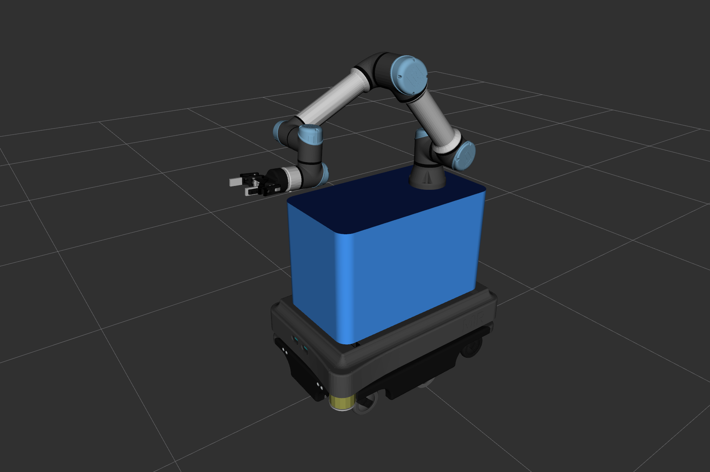
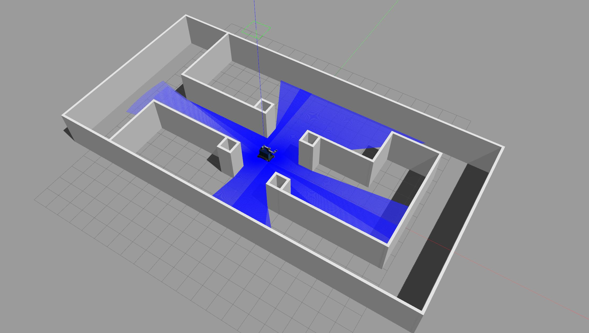
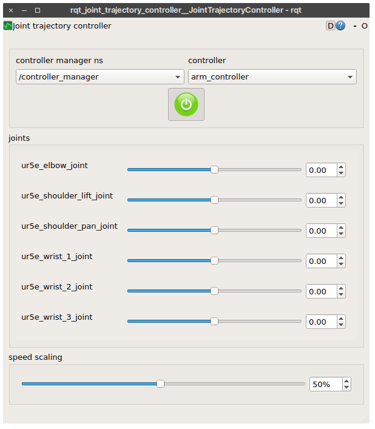

# ros_tutorials3



---

## Installation

```shell
$ mkdir -p ~/catkin_ws/src
$ cd ~/catkin_ws/src
$ wstool init
$ wstool merge https://gist.githubusercontent.com/byeongkyu/03c0c6063835c470de594e3aa521d8a4/raw/ros_tutorials3.rosinstall
$ wstool update
$ rosdep install --from-paths . --ignore-src -r -y
$ find -name 'requirements.txt' | xargs -L 1 sudo pip install -U -r
$ catkin build
```

## Launch

### View rviz

    $ roslaunch mir200_w_ur5e_robot_description view_robot.launch
    $ rviz -d `rospack find mir200_w_ur5e_robot_description`/view_robot.rviz


### Gazebo with controllers

    $ roslaunch mir200_w_ur5e_robot_gazebo bringup.launch




### For control joints manually

    $ rosrun rqt_joint_trajectory_controller rqt_joint_trajectory_controller



---

### For Navigation

#### Map building

    $ roslaunch mir200_w_ur5e_robot_navigation slam_gmapping.launch
    $ rosrun teleop_twist_keyboard teleop_twist_keyboard.py

#### Navigation

    $ roslaunch mir200_w_ur5e_robot_navigation bringup_navigation.launch


---

### For MoveIt!

    $ roslaunch mir200_w_ur5e_robot_moveit_config move_group.launch
    $ roslaunch mir200_w_ur5e_robot_moveit_config moveit_rviz.launch rviz_config:=`rospack find mir200_w_ur5e_robot_moveit_config`/launch/moveit.rviz

